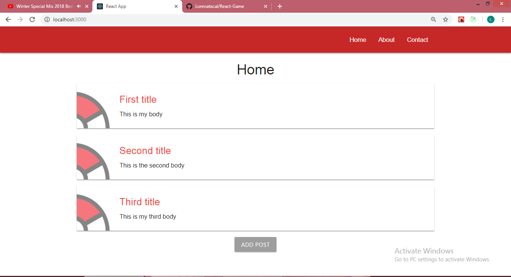

# Poke Time App
Poke Time is a React App in which the user can Add/Edit and Delete Posts. The user can see on the Home Page three initial posts and he can Add new Posts to the existing ones, by clicking Add Post Button and by submiting a new Post. Once he openes a Post he can Edit this Post or Delete it. On the Nav Bar there are also an About us Page and a Contact Us page that can be accesed.

## To start the Project:
* Install and start the app:

    - ```clone the repo```
    - ```cd into the folder```
    - ```run npm install```
    - ```npm start```

## Screenshots
Home Page with Posts:


New Post Form:


Post:


About Page


Contact Page

* Install and start the app:

#### To see the game online: https://poke-time.herokuapp.com/

#### Testing

 * To run the tests: ```click npm run test```

## Extra Info
Poke time is a React App in which I used for the first time Redux to manage the state of the application and React Router to create the routers for the Nav Bar. In order to create this project I have followed a tutorial, but I have improved the App by adding a Delete Post Button  and an Edit Post Button, this made me use and learn all 4 basic functions of storage (C.R.U.D.) All the components of the App are tested, including the actions, the components and the reducers; this being  also the first time when I have tested mapStateToProps and MapDispatchToProps
